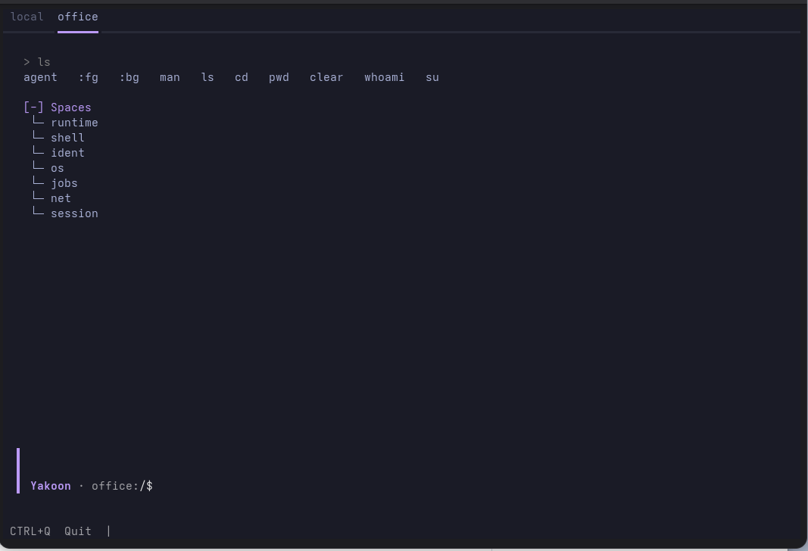

<p align="center">
    
</p>

A runtime for process-oriented software.

[]()
[](LICENSE)
[]()
[](https://github.com/yakoon-runtime/yakoon/actions/workflows/tests.yml)

Most software systems are organized around applications, screens and users.

We rarely question this.

A process starts in a client.
A user owns the workflow.
Closing the application often means interrupting the work.

This model has become so familiar that it appears natural.

But enterprises are not made of screens.

They are made of decisions, responsibilities, information and processes.

Processes exist whether a browser is open or not.

They continue when employees change.
They continue when clients disconnect.
They continue when systems are replaced.

If processes are real objects of an enterprise, software must be designed around them.

Yakoon is an experiment to test that assumption.

```
┌─────────────┐  ┌─────────────┐  ┌─────────────┐
│   Texture   │  │     Web     │  │   Console   │
│   --------  │  │   -------   │  │   -------   │
│    (TUI)    │  │  (Browser)  │  │  (Terminal) │
└──────┬──────┘  └──────┬──────┘  └──────┬──────┘
       │                │                │
       └────────────────┼────────────────┘
                        │
                ┌───────▼────────┐
                │    Runtime     │
                │     Flows      │
                │    Sessions    │
                │     State      │
                └────────────────┘
```

Connect from any client. The runtime keeps working.

Clients and runtimes use the same connection model. A runtime can observe another runtime just like any other client.

## Core Architecture

```
Flow → State → Projection → UI
```

- **Flow** — Executable state machine (async generators)
- **State** — Deterministic, captures decisions
- **Projection** — Pure function: `projection = f(state)`
- **Client** — Any UI (console, web, TUI, SSH); never owns state

## Current Status

Yakoon is under active development. Persistent storage, session lifecycle management and multi-client orchestration are still evolving toward the 1.0 release.

## Example Session

The Texture client connected to a runtime — showing spaces, commands, and live projections.



## Quick Start

```bash
pip install -e apps/y5napp-runtime
pip install -e apps/y5napp-textual

# Terminal 1: Runtime
yakoon-runtime

# Terminal 2: TUI client
yakoon-texture
```

### Package vs Module vs Executable

| Package (pip) | Python Module | Command |
|---|---|---|
| `y5napp-runtime` | `y5napp.runtime` | `yakoon-runtime` |
| `y5napp-textual` | `y5napp.textual` | `yakoon-texture` |

For development or debugging:

```bash
python -m y5napp.runtime
python -m y5napp.textual
```

See [docs/GETTING_STARTED.md](docs/GETTING_STARTED.md) for full setup details.

## AI Integration

AI is a capability, not the product. Yakoon can connect different AI models per domain — small local models for sensitive data, large cloud models for creative work. The runtime decouples AI from infrastructure.

See [docs/MANIFEST.md](docs/MANIFEST.md) for the full reasoning.

## Documentation

| Document | Purpose |
|----------|---------|
| [ARCHITECTURE.md](docs/ARCHITECTURE.md) | Core architecture & philosophy |
| [DECISIONS.md](docs/DECISIONS.md) | Architecture decision record |
| [MANIFEST.md](docs/MANIFEST.md) | Why Yakoon exists |
| [TESTING.md](docs/TESTING.md) | Testing strategy |
| [GETTING_STARTED.md](docs/GETTING_STARTED.md) | Setup & usage |
| [CONTRIBUTING.md](CONTRIBUTING.md) | How to contribute |

## License

Apache 2.0. See [LICENSE](LICENSE).
